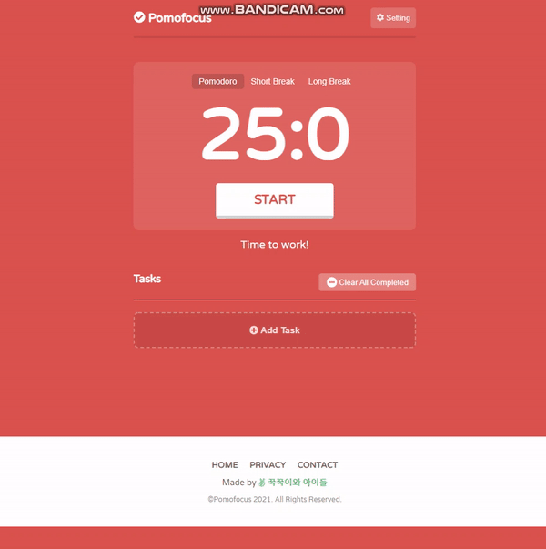
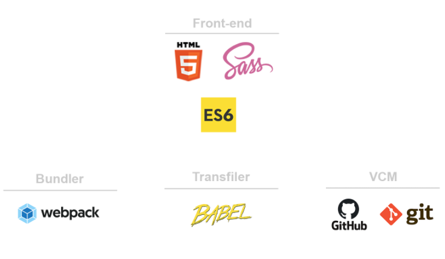

# ⏰뽀모도로, 클론 코딩⏰

## ✨ 서비스 소개

뽀모도로 기법이란 25분 동안 한가지 일에 전적으로 집중하고 5분 휴식하여 집중시간에는 인터넷 뉴스를 보거나 소셜 미디어에 한 눈 팔지 않고 오직 일에만 집중하는 기법이다.

## 👨‍👨‍👧‍👦 함께한 사람들

- [👨병국](https://github.com/bg-shorthand)
- [👸지원](https://github.com/iamkjw77)
- [🧑봉철](https://github.com/bcround)

## 🎈 기술 스택

## 🔊 주요 기능

#### `<Task List>`

- Task 추가 및 삭제
- Task 체크
- Task 별 횟수 설정
- 총 Task 종료 시간 표시

##### `<Timer>`

- 스탑 워치
- 모드 전환
- 시간 설정
